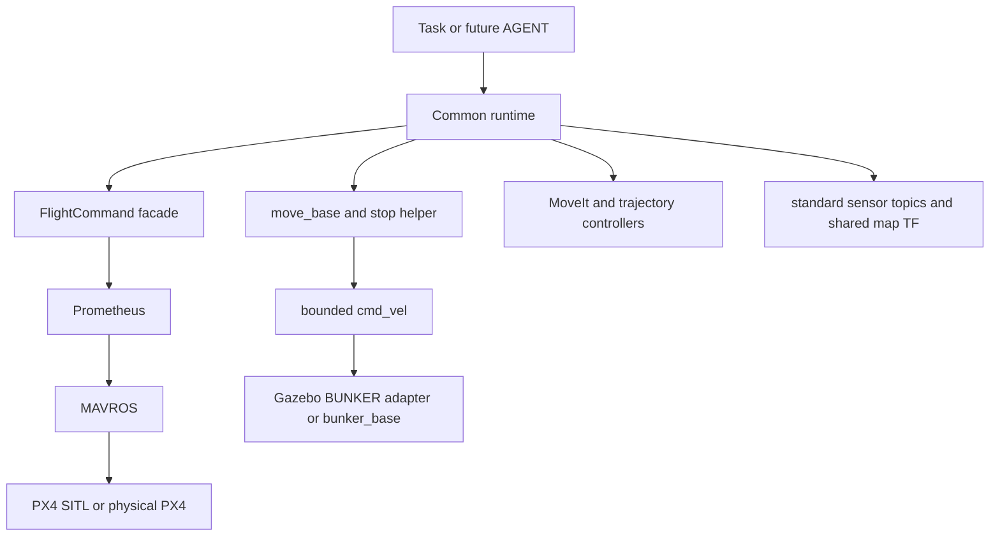

# Simulation Platform V1.0

Stable P450 + BUNKER + AUBO i5 + AG95 multi-robot simulation for ROS 1 and
Gazebo Classic.

[中文概览](#中文概览) · [English Documentation](#english-documentation) ·
[Build](#build) · [Run](#run-the-platform) ·
[Air-Ground Pick Demo](#air-ground-pick-demo)

## 中文概览

Simulation Platform V1.0 是一个面向空地协作机器人的 ROS 1/Gazebo 联合仿真平台，当前包含：

- P450 无人机、PX4 SITL、MAVROS、Prometheus、D435 和 MID360；
- BUNKER 移动底盘、2D LiDAR、IMU；
- AUBO i5 机械臂、AG95 夹爪、腕部 D435、MoveIt；
- 共用 `map` 坐标系、`move_base` 导航和最小 Air-Ground Pick Demo。

平台的核心边界是：

```text
AGENT / 任务代码 -> 公共机器人接口 -> 官方原生机器人软件栈
```

上层任务只使用公共 action、ROS topic、MoveIt 和 TF，不依赖 Gazebo API
或 `world` 坐标系。当前仓库实现并验证的是 SIM backend；未来实机只需替换
PX4、BUNKER driver、传感器和定位 adapter 的最底层实现。

快速入口：

- [系统架构](#architecture)
- [公共机器人接口](#robot-facing-interfaces)
- [环境和构建](#prerequisites)
- [启动联合平台](#run-the-platform)
- [运行自然抓取 Demo](#air-ground-pick-demo)
- [实机替换边界](#sim-to-real-boundary)

本项目只建设稳定、真实、可复用的机器人仿真 runtime，不包含论文
benchmark、Task-aware、RL、World Model 或 LLM/VLM 算法基础设施。RM4D
只通过只读外部依赖和薄接口接入，算法本体不进入本仓库。

## SIM/REAL robot-facing contract

The canonical shared-frame chains are:

```text
map -> uav1/odom -> uav1/base_link
map -> ground/odom -> ground/base_link
```

The intended physical backends are
`p450_experiment + Prometheus + MAVROS + PX4` and
`bunker_base -> ugv_sdk -> CAN`. Public commands, state, sensors, navigation,
manipulation, and grasp interfaces are detailed below.

## English Documentation

### Status and scope

Simulation Platform V1.0 provides a reusable ROS 1 runtime for a P450 aerial
robot and a BUNKER mobile manipulator carrying an AUBO i5 arm and AG95 gripper.
It is built for natural robotics development: commands go through normal robot
interfaces, perception comes from simulated sensors, motion uses controllers
and planners, and grasping requires physical contact.

| Area | V1.0 implementation |
| --- | --- |
| Aerial platform | P450, PX4 SITL, MAVROS, Prometheus |
| Ground platform | BUNKER-compatible ROS boundary and Gazebo motion backend |
| Manipulation | AUBO i5, AG95, ros_control, MoveIt |
| Sensors | Two D435 profiles, MID360, 2D LiDAR, IMU |
| Navigation | Shared `move_base` layer and bounded `/cmd_vel` path |
| Global coordinates | One shared `map` with replaceable localization edges |
| End-to-end task | One-flight Air-Ground observation, approach, grasp, and lift |

Physical P450, BUNKER, and AG95 adapters are **not included in V1.0**. Their
official software stacks are the intended replacement backends, not code that
this repository reimplements.

### Architecture



The common runtime contains robot-facing interfaces. Simulator-specific model
spawning, Gazebo plugins, `world -> map`, and contact interpretation stay below
the SIM backend boundary.

The P450 flight facade is deliberately thin. It translates
`FlightCommandAction` requests to native Prometheus
`UAVCommand/UAVSetup/UAVState/UAVControlState`; Prometheus remains the only
flight state-machine and control authority.

The BUNKER navigation layer is shared by SIM and REAL. `move_base` produces
`/ground/nav_cmd_vel`, the velocity guard forwards a bounded command to
`/ground/cmd_vel`, and only the hardware/backend adapter changes.

### Robot-facing interfaces

#### P450

| Interface | Type or purpose |
| --- | --- |
| `/uav1/runtime/flight` | `robot_runtime_interfaces/FlightCommandAction`: `TAKEOFF`, `FLY_TO`, `HOVER`, `LAND` |
| `/uav1/prometheus/state` | Native `prometheus_msgs/UAVState` |
| `/uav1/prometheus/control_state` | Native `prometheus_msgs/UAVControlState` |
| `/uav1/prometheus/odom` | `nav_msgs/Odometry` in `uav1/odom` |
| `/uav1/camera/color/image_raw` | D435 RGB image |
| `/uav1/camera/depth/image_raw` | D435 depth image |
| `/uav1/camera/imu` | D435 IMU |
| `/uav1/livox/lidar` | MID360 `sensor_msgs/PointCloud2` |

#### BUNKER and navigation

| Interface | Type or purpose |
| --- | --- |
| `/ground/move_base` | `move_base_msgs/MoveBaseAction` |
| `/ground/runtime/stop` | Cancel navigation and deliver zero velocity |
| `/ground/nav_cmd_vel` | Raw navigation output |
| `/ground/cmd_vel` | Hardware-boundary `geometry_msgs/Twist` |
| `/ground/odom` | Hardware-boundary `nav_msgs/Odometry` |
| `/ground/bunker_status` | `bunker_msgs/BunkerStatus` |
| `/ground/scan` | `sensor_msgs/LaserScan` |
| `/ground/imu/data` | `sensor_msgs/Imu` |

The SIM base emulates this ROS boundary only. It does not emulate `ugv_sdk`,
CAN frames, motor controllers, or electrical behavior.

#### Manipulation and grasp

| Interface | Purpose |
| --- | --- |
| `/ground/arm_controller/follow_joint_trajectory` | AUBO trajectory execution |
| `/ground/gripper_controller/follow_joint_trajectory` | AG95 trajectory execution |
| `/ground/joint_states` | Manipulator joint feedback |
| MoveIt group `manipulator` | Collision-aware arm planning |
| `ground/gripper_tcp_link` | Tool center point |
| `/ground/gripper/grasp_confirmed` | Backend-neutral retained-object state |

SIM derives `grasp_confirmed` from strict bilateral Gazebo contacts and gripper
position. A future real adapter may use AG95 position, current, status, tactile
feedback, or a minimal combination of those signals.

### Shared TF and localization

Upper-level code uses `map`, never Gazebo `world`:

```text
map
|-- uav1/odom
|   `-- uav1/base_link
`-- ground/odom
    `-- ground/base_link
```

`map -> uav1/odom` and `map -> ground/odom` form the Localization Adapter
Contract. Both robots must reach the same `map`, and each TF edge must have one
authority. Gazebo provides these edges in SIM; RTK, VIO, SLAM, EKF, or a chosen
fusion stack may provide them on real robots.

### Prerequisites

The verified host stack is:

- Ubuntu 20.04;
- ROS Noetic with Gazebo Classic 11;
- Catkin Tools and Python 3;
- MAVROS, MoveIt 1, `move_base`, ros_control/controller packages;
- PCL, OpenCV, Eigen, Xacro, Ninja, and normal Gazebo development packages;
- an external compatible PX4 checkout with its SITL artifacts already built.

Use `rosdep` to install declared ROS dependencies after sourcing Noetic:

```bash
source /opt/ros/noetic/setup.bash
rosdep install --from-paths src --ignore-src --rosdistro noetic -r -y
```

#### External PX4 requirement

PX4 is intentionally not vendored into this repository. Set
`P450_PX4_ROOT` to an absolute path containing the validated checkout:

```bash
export P450_PX4_ROOT=/absolute/path/to/the/compatible/px4-checkout
```

The current runtime contract pins PX4 commit
`713814f4eea5990e49dd776a38a36ad53e171f60` and its `Tools/sitl_gazebo`
checkout at `9566172e7c0760f66681304b963d675c5b120daf`. The checkout must already
contain `build/amovlab_sitl_default/bin/px4` and the matching Gazebo plugins.
See [`config/p450_runtime.json`](config/p450_runtime.json) for the complete
machine-checked artifact contract.

### Build

Clone and enter the repository:

```bash
git clone git@github.com:Dellsonorb/Simulation-Platform.git
cd Simulation-Platform
```

Create the install-enabled Catkin profile and build all workspace packages:

```bash
source /opt/ros/noetic/setup.bash

scripts/with_noetic_env.bash catkin config \
  --workspace "$PWD" \
  --profile p450-clean \
  --init \
  --extend /opt/ros/noetic \
  --merge-devel \
  --install \
  --install-space install/p450-clean \
  --cmake-args \
    -DCMAKE_BUILD_TYPE=RelWithDebInfo \
    -DPYTHON_EXECUTABLE=/usr/bin/python3

scripts/with_noetic_env.bash catkin build \
  --workspace "$PWD" \
  --profile p450-clean \
  --no-status

source install/p450-clean/setup.bash
```

The short equivalent for an already configured checkout is:

```bash
catkin build --profile p450-clean --no-status
source install/p450-clean/setup.bash
```

Build the small PX4/Gazebo compatibility overlay once after the Catkin build:

```bash
P450_PX4_ROOT="$P450_PX4_ROOT" \
  ./scripts/build_p450_runtime_overlays.bash
```

Keep Miniconda or other private Protobuf installations out of the Catkin
configure `PATH`; Gazebo 11 must resolve the system Protobuf version used by
ROS Noetic.

### Run the platform

Launch the combined P450 + BUNKER + AUBO i5 + AG95 world:

```bash
P450_PX4_ROOT="$P450_PX4_ROOT" \
  ./scripts/with_p450_env.bash \
  roslaunch sim_platform_bringup air_ground_standalone.launch \
    gui:=true enable_mid360:=true
```

The reusable runtime launch contains one Gazebo world, one P450/PX4 instance,
one ground robot, the common flight facade, shared navigation, controllers,
sensors, and Localization Adapter TF edges. Stop it with `Ctrl-C`.

For a headless bounded health check that cleans up its processes automatically:

```bash
P450_PX4_ROOT="$P450_PX4_ROOT" \
  ./scripts/smoke_air_ground_standalone.bash --gui false
```

### Air-Ground Pick Demo

The minimal natural task executes this sequence:

```text
preflight
  -> one P450 takeoff
  -> aerial RGB-D observation
  -> land and hand off the target in map
  -> move BUNKER only when required
  -> stop
  -> wrist-D435 near-field observation
  -> MoveIt pre-grasp
  -> physical AG95 grasp confirmation
  -> lift
```

Run the complete bounded E2E:

```bash
P450_PX4_ROOT="$P450_PX4_ROOT" \
  ./scripts/smoke_air_ground_pick_demo.bash --gui false
```

Set `--gui true` to observe Gazebo. A successful run prints its `summary.json`
path and exits after `LIFT`. The E2E checker may inspect Gazebo model state as
an external SIM test oracle; the task runtime itself does not consume Gazebo
ground truth.

### Deterministic RM4D integration

RM4D remains a read-only external algorithm dependency. The supported baseline
is tag `rm4d-aubo-baseline-v1`, commit
`e9d431299053f38a4a4319aed3dfeccc261b9fac`. The 10M reachability map used by
the verified integration has SHA-256
`77279fafaf61d5c92cf303a644cd9613457c85e0d197c66c4487c30d135db3b4`.

The data path is:

```text
P450 RGB-D observation in map
  -> exact side-up grasp TCP
  -> thin BasePlacementAPI adapter
  -> ranked BUNKER poses in map
  -> candidate 0 unchanged to /ground/move_base
  -> exact aerial-derived MoveIt pregrasp for D435 refinement
  -> refined grasp -> physical AG95 confirmation -> Lift
```

The adapter applies the frozen `Local-Y +1e-6 rad` deterministic numerical
regularization only to a copy of the RM4D query pose. The published grasp TCP,
the target-facing observation/pregrasp pose, and every MoveIt execution pose
remain unperturbed. Candidate order is never changed by SIM; navigation and
MoveIt expose real execution failures.

Point the adapter at the exact detached checkout, its Python environment, and
the existing map. Nothing is copied into SIM:

```bash
export RM4D_ROOT=/absolute/path/to/rm4d-aubo-baseline-v1-checkout
export RM4D_PYTHON=/absolute/path/to/rm4d-python
export RM4D_MAP=/absolute/path/to/rmap.npy

source install/p450-clean/setup.bash
rosrun rm4d_sim_integration replay_rm4d_observation.py \
  --mode offline --rm4d-root "$RM4D_ROOT" \
  --rm4d-map "$RM4D_MAP" --top-k 5
```

After starting the integration launch, inspect exact TCP and ranked top-K
candidates in RViz:

```bash
rviz -d "$(rospack find rm4d_sim_integration)/rviz/rm4d_candidates.rviz"
```

Run the bounded natural E2E with the normal sensor, navigation, controller,
MoveIt, contact, and Lift path:

```bash
P450_PX4_ROOT="$P450_PX4_ROOT" \
RM4D_ROOT="$RM4D_ROOT" RM4D_PYTHON="$RM4D_PYTHON" RM4D_MAP="$RM4D_MAP" \
  ./scripts/smoke_rm4d_air_ground_pick_demo.bash --gui false
```

The frozen static footprint filter is not a navigation-feasibility proof.
`move_base` and its costmaps remain authoritative for actual reachability, and
MoveIt remains authoritative for manipulation feasibility.

The verified natural run used the P450 RGB-D estimate to produce the exact
grasp TCP, published five unchanged ranked candidates in RViz, and navigated
top-1 `candidate-000203` at
`[2.847836, 0.316032, -3.141593]`. Ground travel was `0.319565 m`; the Ground
D435 then refined the target, AG95 confirmed the physical grasp, and the
dynamic Brick rose `0.149966 m` (`0.149406 m` measured TCP lift). The checker
completed with `RM4D_SIM_INTEGRATION_READY`.

One exposed method gap remains visible by design: in that run the oblique
far-field P450 estimate had a roughly `5.9 cm` lower center height than the
near-field Ground D435 estimate. No Gazebo ground truth or post-hoc correction
was substituted into the RM4D request. The frozen RM4D footprint/IK result is
also not a proof of `move_base` or full-scene MoveIt feasibility; those runtime
systems continue to decide and expose real failures.

### Verification

Focused public-interface checks:

```bash
source install/p450-clean/setup.bash
/usr/bin/python3 -m unittest -q \
  tests.test_public_readme \
  tests.test_sim_to_real_interface_contract
```

The maintained acceptance path consists of:

1. a clean install-enabled Catkin build of all 27 packages;
2. the Python interface, TF, sensor, controller, navigation, and demo tests;
3. `scripts/smoke_air_ground_standalone.bash`;
4. `scripts/smoke_air_ground_pick_demo.bash` reaching physical `LIFT`.

Smoke outputs are local runtime logs and are intentionally ignored by Git.

### Sim-to-Real boundary

The intended deployment flow is:

```text
AGENT -> common runtime -> official native robot stack
```

Replace only the lowest adapters:

| Robot | Replace for REAL | Keep unchanged |
| --- | --- | --- |
| P450 | PX4 SITL/model, Gazebo D435/MID360, SIM localization | Flight facade clients, Prometheus command/state contract, tasks and perception |
| BUNKER | Gazebo base, Gazebo LiDAR/IMU, SIM localization | `move_base`, costmaps/planners, stop helper, `/cmd_vel`, odom/status/TF contract |
| AG95 | Gazebo contact-to-grasp adapter | `grasp_confirmed` and upper grasp/lift logic |

The expected physical chains are
`p450_experiment -> Prometheus -> MAVROS -> PX4` and
`bunker_ros -> bunker_base -> ugv_sdk -> CAN`. The common runtime does not
reimplement either native control stack.

### Repository layout

```text
config/             pinned runtime and imported-source metadata
docs/               architecture, design specifications, and implementation plans
runtime_overlays/    minimal PX4/Gazebo compatibility build
scripts/             environment wrappers, smoke checks, and E2E checkers
src/demos/           minimal Air-Ground Pick Demo
src/ground/          BUNKER navigation and AUBO/AG95 packages
src/integrations/    thin adapters for read-only external algorithms
src/p450/            P450, Prometheus, D435, MID360, and PX4-facing packages
src/platform/        common interfaces, SIM adapters, and joint bringup
src/vendor/          required robot descriptions and compatible ROS messages
tests/               platform-level contract and regression tests
tools/               source/runtime validation helpers
```

Generated `build/`, `devel/`, `install/`, `logs/`, `.catkin_tools/`, and
`.worktrees/` directories are not published.

### Known limitations

- V1.0 is verified on Ubuntu 20.04, ROS Noetic, and Gazebo Classic 11; ROS 2
  and modern Gazebo are outside the current scope.
- The exact external PX4 checkout and SITL build are required by the runtime
  validator and are not downloaded automatically.
- Physical P450/BUNKER localization, sensor, CAN, and AG95 feedback adapters
  remain future integration work.
- The world and target are intentionally minimal; this repository is a robot
  runtime, not a benchmark suite or research-algorithm repository.
- No repository-wide license has been declared. Several imported robot assets
  retain unresolved upstream redistribution markers; review every component's
  `package.xml` and upstream terms before redistribution.

### Design documentation

- [Sim-to-Real Robot Interface Design](docs/superpowers/specs/2026-09-02-sim-to-real-robot-interface-design.md)
- [Ground Manipulator Runtime Design](docs/superpowers/specs/2026-09-01-ground-manipulator-a-design.md)
- [BUNKER Standalone Runtime Design](docs/superpowers/specs/2026-09-01-bunker-a-standalone-runtime-design.md)
- [GitHub Publication and README Design](docs/superpowers/specs/2026-09-03-github-publication-readme-design.md)
- [RM4D to SIM Integration Design](docs/superpowers/specs/2026-09-03-rm4d-sim-integration-design.md)
